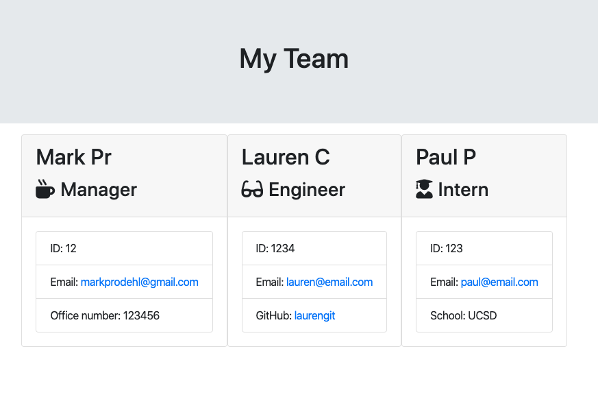

# Employee Summary Template 
            
                                     
            
 # Description:
            
 A Node CLI that takes in information about employees and generates an HTML webpage that displays summaries for each employee. The application will prompt the user for information about the team manager and then information about the team members. The user can input any number of team members, and they may be a mix of engineers and interns. When the user has completed building their team, the application will create an HTML file that displays a formatted team roster based on the information provided by the user.
            
 # Table Of Contents
            
 ### 1. Installation
            
 ### 2. Usage
            
 ### 3. License
            
 ### 4. Contributors
            
 ### 5. Tests
            
 ### 6. Questions
            
 ### 7. Contact
            
 # Installation
            
 Run 'npm install i' to download the neccessary dependencies.
            
 # Usage
            
 The Employee Summary Template can be used to create a chart of team memebers. The chart will clearly seperate employees based on whether they are a manager, engineer, or an intern.
            
 # License
            
 
            
 # Contributing
            
 Mark Prodehl
            
 # Tests
            
 Jest - npm run test
            
 # Questions
            
 Yes, the application will prompt the user for information about their team members.
            
 # Contact
            
 markprodehl@gmail.com           
            
 GitHub Username: markprodehl    

                            
            